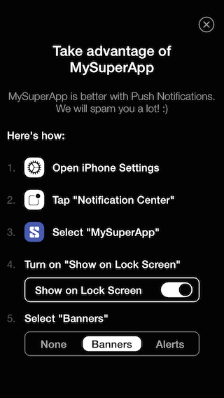
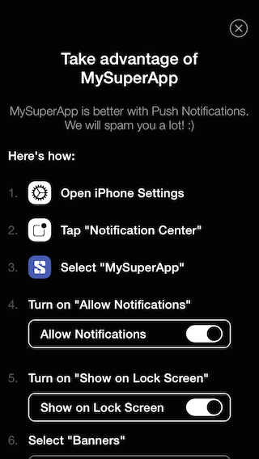

# STNotificationHelper

[](https://travis-ci.org/nmaletm/STNotificationHelper)
[](http://cocoadocs.org/docsets/STNotificationHelper)
[](http://cocoadocs.org/docsets/STNotificationHelper)
[](http://cocoadocs.org/docsets/STNotificationHelper)


Forked project from [MHNotificationHelper](https://github.com/mariohahn/MHNotificationHelper), with support for iOS8 and above (the instructions are different) and translation to some languages.





Steps with iOS7 (left), and steps with iOS8/iOS9 (right)

## Language support

```
ca, de, en, es, fr, id, it, ja, pl, pt, ru, sv, zh-Hant, zh-Hans
```

If you want to contribute and translate to another language, make me a pull request or contacte me by [Twitter](https://twitter.com/NestorMalet) / [Email](http://www.nestor.cat/contact). I will answer asap.

## Installation

Is very easy to add this library to your project using CocoaPods, you must add this line to your Podfile, and then make `pod install`.
```ruby
pod 'STNotificationHelper'
```

##Usage
First you have to include the library to your code:

```objective-c
#import <STNotificationHelperViewController.h>
```

And then add this code to show the view controller helper:

```objective-c
NSString *title = NSLocalizedString(@"Take advantage of MySuperApp", nil);
NSString *description = NSLocalizedString(@"MySuperApp is better with Push Notifications. We will spam you a lot! :)", nil);

STNotificationHelperObject *notificationObject = [STNotificationHelperObject objectWithTitle:title description:description];

STNotificationHelperViewController *notificationHelper = [STNotificationHelperViewController.alloc initWithNotification:notificationObject];

[self presentViewController:notificationHelper animated:YES completion:nil];


```


Or you can set your own app icon and app name:
```objective-c
NSString *title = NSLocalizedString(@"Take advantage of MySuperApp", nil);
NSString *description = NSLocalizedString(@"MySuperApp is better with Push Notifications. We will spam you a lot! :)", nil);

UIImage *icon = [UIImage imageNamed: @"myLogo.png"];
NSString *appName = @"My app name";

STNotificationHelperObject *notificationObject = [STNotificationHelperObject 
  objectWithTitle:title
      description:description
          appIcon:icon
          appName:appName];

STNotificationHelperViewController *notificationHelper = [STNotificationHelperViewController.alloc initWithNotification:notificationObject];

[self presentViewController:notificationHelper animated:YES completion:nil];


```

## Authors

* Mario Hahn, https://github.com/mariohahn (author of the original forked Pod)
* Néstor Malet, http://www.nestor.cat

## Translations

* Chinese (traditional script): Retso Huang, https://github.com/retsohuang.
* Japanese: Akira MATSUDA, https://github.com/0x0c.
* Chinese (simplified script): Herb Brewer, https://github.com/exherb.

## ChangeLog

You can see all the change log at [ChangeLog](CHANGELOG.md).

## License

STNotificationHelper is available under the MIT license. See the LICENSE file for more info.

## Donating

Support this project via gittip.

<a href="https://gratipay.com/nmaletm/" target="_blank">
  
</a>
